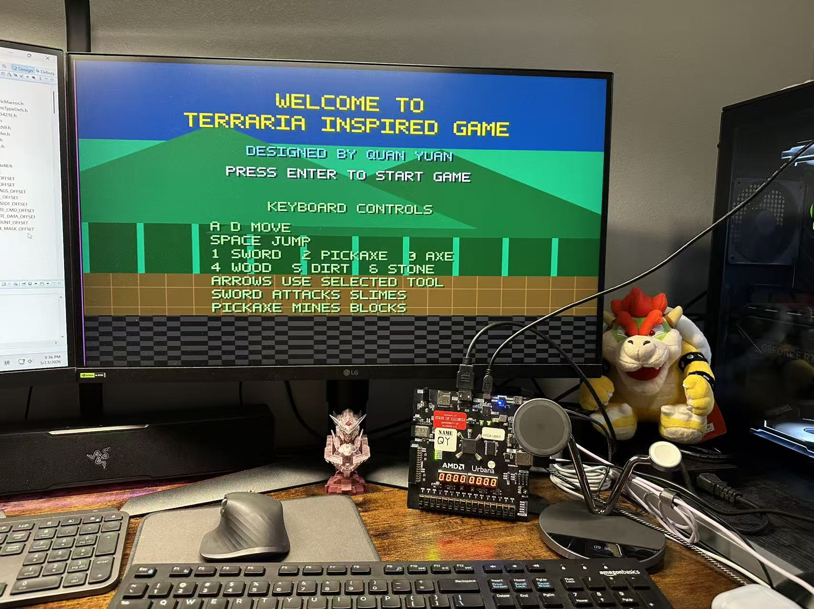
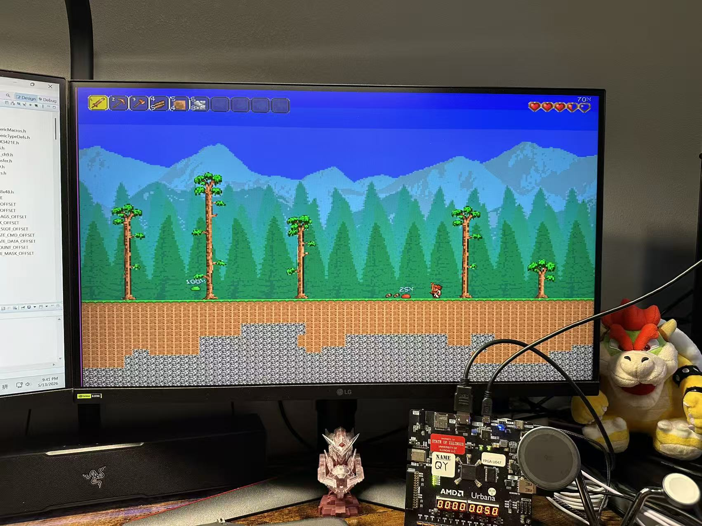

# Terraria-Inspired FPGA Game

Designed by Quan Yuan.

This project is a Terraria-inspired 2D side-scrolling game implemented on an FPGA using a MicroBlaze-based system, HDMI video output, USB keyboard input, BRAM/ROM sprite assets, and custom SystemVerilog rendering logic.

## Project Overview

The game recreates a Terraria-style world with a scrolling tile map, animated player character, tools, enemies, collectibles, block mining, block placement, tree chopping, health display, start screen, and death screen.

The player can move around the world, mine terrain, collect dropped blocks, place blocks back into the world, fight slimes, and fight a King Slime boss after defeating the initial enemies.

## Screenshots

### Start Screen and Controls

### Main Gameplay

## Hardware Requirements

- Urbana FPGA board or compatible ECE 385 FPGA setup
- HDMI monitor
- USB keyboard connected through the MAX3421E USB host interface
- Micro-USB/JTAG connection for programming and serial output

## Software Requirements

- Xilinx Vivado for FPGA synthesis, implementation, and bitstream generation
- Xilinx Vitis or SDK for compiling and running the MicroBlaze C application
- Board support package matching the exported Vivado hardware design

## How to Build and Run

1. Open Vivado and use **Open Project** to open the `final_project` Vivado project inside the `final_project` folder.
2. In Vivado, click **Tools > Launch Vitis IDE**.
3. When Vitis asks for a workspace, create a new workspace named `sdk` inside the `final_project` folder.
4. In Vitis, create a new application project.
5. When selecting the platform, choose the generated `mb_final_top.xsa` file from the `final_project` folder.
6. Name the new application project `Terraria`.
7. Select the **Hello World** template to create the project.
8. Copy all source files from the original project folder `final_project/sdk/Terraria/src` into the new workspace project folder with the same relative path, replacing the default Hello World source files.
9. Build the `Terraria` application project.
10. Connect the FPGA board, HDMI display, and USB keyboard.
11. In Vitis, create or select a run configuration using the GDB hardware launch option.
12. Run the `Terraria` application on the FPGA board.
13. The start screen should appear on the HDMI display. Press `Enter` to start the game.

## Keyboard Controls

| Key | Action |
| --- | --- |
| `A` | Move left |
| `D` | Move right |
| `Space` | Jump |
| `Enter` | Start game / restart after death |
| `1` | Select sword |
| `2` | Select pickaxe |
| `3` | Select axe |
| `4` | Select wood block |
| `5` | Select dirt block |
| `6` | Select stone block |
| Left / Right Arrow | Use selected tool or place selected block left/right |
| Up Arrow | Mine or place upward depending on selected item |
| Down Arrow | Mine or place downward depending on selected item |

## Implemented Features

- Start screen with title, designer names, and control instructions
- Terraria-style scrolling background and tile world
- Animated player movement, jumping, and tool actions
- Sword attack animation
- Pickaxe mining animation
- Axe chopping animation
- Hotbar selection and highlighting
- Health display with percentage and blood HUD
- Wood, dirt, grass, and stone blocks
- Block mining with different hit requirements:
  - Wood: 2 hits
  - Dirt: 2 hits
  - Grass: 2 hits
  - Stone: 4 hits
- Dropped collectible items for wood, dirt, and stone
- Automatic pickup when the player overlaps a dropped item
- Inventory counts displayed in the toolbar
- Block placement from collected items
- Decorative trees with different chopping times and wood drop counts
- Green, blue, and red slimes with different health and damage values
- Slime health percentage display
- Slime knockback when hit by the sword
- Player damage and knockback when hit by enemies
- King Slime boss after the initial slimes are defeated
- King Slime health display
- King Slime summoning smaller blue slimes
- King Slime rage behavior below 50 percent health
- Death screen with restart prompt

## Game Flow

When the system starts, the game displays a start screen. Pressing `Enter` begins gameplay.

The player can explore the side-scrolling map, mine blocks with the pickaxe, collect dropped items, place collected blocks, chop trees with the axe, and attack enemies with the sword.

After the three initial slimes are defeated, King Slime appears. The player must avoid contact damage, defeat summoned slimes, and attack King Slime until its health reaches zero.

If the player's health reaches zero, the death screen appears. Pressing `Enter` restarts the game.

## Notes

The project also experimented with UART communication between two FPGA boards for audio triggering. The intended design was to send player state from the game board to a second board that would play different sound effects. UART integration was not completed in the final game, but the audio effects can be demonstrated separately using buttons.

## Known Limitations

- The game is designed for the specific FPGA, HDMI, USB, and MicroBlaze setup used in the course project.
- UART-based inter-board audio triggering was attempted but not included in the final integrated gameplay.
- Some assets are optimized for FPGA memory limits, so several sprites and backgrounds use reduced resolution or compact memory formats.

